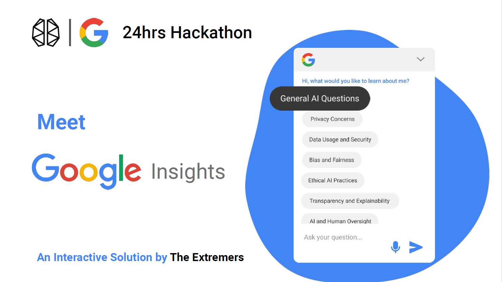

# BrainStation Industry Day with Google

## Introduction
Welcome to our team's GitHub repository for the Google Industry Day one-day hackathon hosted by BrainStation, on July 20, 2023. We are a diverse team of data scientists, UI/UX designers, and web developers, united by our passion for innovation and our commitment to deliver a compelling digital solution to a real-world business problem. Our team's name is *The Extremers*!

## Our team comprises:

- [Moises Vera - Data Scientist](https://www.linkedin.com/in/moisessosav/)
- [Annie Yan - Data Scientist](https://www.linkedin.com/in/annie-yq-yan/)
- [Amir Kiani - Data Scientist](https://www.linkedin.com/in/amirhossein-kiani/)
- [Amy Chen - UX Designer](https://www.linkedin.com/in/amy-xianwen-chen/)
- [Emmanuel Atuahene - Software Engineer](https://www.linkedin.com/in/eatuahene/)
- [Chelsea Quindipan - Software Engineer](https://www.linkedin.com/in/chelsea-quindipan/)
- **Product Manager:** Laura Merino

## Our Story

[Find the presentation on the Industry Day here](https://drive.google.com/file/d/1J_B4bPAX5q5aJRyy-x3jE4rNmaKtGhje/view?usp=sharing)

I'm excited to share our team's approach to educating users about AI-powered Google products while
ensuring user trust and avoiding misunderstandings. Through numerous conversations and discussions,
we arrived at a fundamental idea: "Trust is how predictable, inclusive, and safe we feel towards
something." For instance, just like we trust a lifelong friend to follow through on a favor, communicate
with us, and respect our boundaries, we seek similar predictability and reliability from products and
services.

Our initial focus was to understand the key reasons behind the general population's mistrust in the use
of AI. Through extensive research, we identified three significant factors contributing to this mistrust:
the lack of transparency, concerns about privacy invasion, and the difficulty in establishing ground truth
for evaluating AI algorithm results in products. Addressing these concerns is pivotal in building trust and
confidence in AI technologies.

On a high level, we wish to foster a better understanding of AI through the presentation of educational
insights that will empower users with the knowledge of how AI has been integrated into their day-to-day
experience.

As a result, we are thrilled to introduce "Insights," a powerful widget integrated into the Google
platform. "Insights" provides users with a unique glimpse behind the curtain, offering clear explanations
on how AI enhances their experience, utilizes their data, and delivers the results they receive. With
"Insights," we aim to foster transparency and empower users to confidently embrace AI-related
features.

Let's delve deeper into the capabilities and benefits of this innovative widget.
Our vision centers around training or fine-tuning a sophisticated Large Language Model, such as
Google's LaMDA, using Google product documentation and AI-related knowledge. This process allows us
to develop an advanced widget that seamlessly interacts with Google's AI-powered tools, providing
users with a clear understanding of AI's workings behind the scenes.

Upon interacting with our widget "Insights," users may choose the level of interactivity that best suits
their comfort level. A passive hover-over feature will show basic information on how Google utilizes AI
to enhance its products. Alternatively, click-based interaction will activate a more dynamic chatbot,
capable of providing comprehensive explanations.

With "Insights" actively generating user data, we can collect valuable engagement metrics on the AIpowered tools. By analyzing these metrics using statistical methods (such as ANOVA and A|B testing), we aim to gauge the extent of users' interactions with the AI-powered tools. As we strongly believe that
user engagement directly correlates with trust, this analysis will offer valuable information into the level
of trust users have in our AI products.

By understanding this relationship, we can make actionable changes to the way users see, experience, and interact with Google products and AI technologies.

## Data Scientists
As data scientists, our team strives to harness the full potential of data, unearthing valuable insights that drive informed decision-making. Moises Vera, Annie Yan, and Amir Kiani employ their unique skills to analyze, interpret, and manipulate data in innovative ways. With a focus on advanced statistical techniques and cutting-edge machine learning algorithms, we are determined to deliver an exceptional digital solution that empowers Google with actionable intelligence. Our passion for exploring data intricacies and commitment to excellence ensure that our contributions are at the forefront of data-driven innovation.

## UI/UX
Our gifted UX designer, Amy Chen, leads the charge in creating seamless and intuitive user interfacing experiences. Grounded in a deep understanding of user behavior, Amy's creativity shines through in crafting a captivating and functional user interface. Through meticulous research and user testing, our team ensures that Google's digital solution provides a delightful and engaging user experience.

## Software Engineers
The heart of our project lies with The Extremers' web developers, Emmanuel Atuahene and Chelsea Quindipan, who bring ideas to life through their coding prowess. With expertise in various programming languages and frameworks, they collaborate seamlessly to build a robust and scalable digital solution for Google. Through agile development methodologies, continuous testing, and iterative improvements, our web developers ensure that Google receives a high-performance and user-friendly solution that sets new standards in the digital landscape.

We appreciate your interest in our project and invite you to look through our work. If you have any questions, please feel free to reach out to us at ahosseinkiani@gmail.com.

The Extremers
